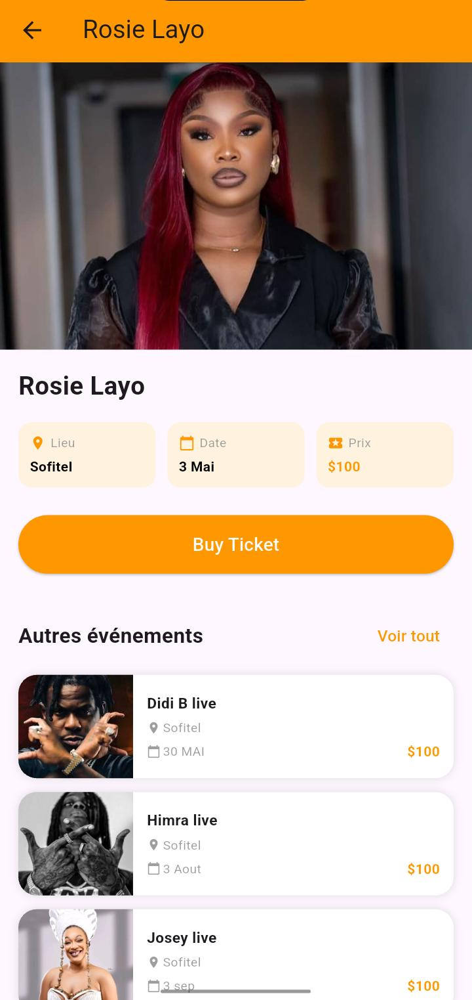
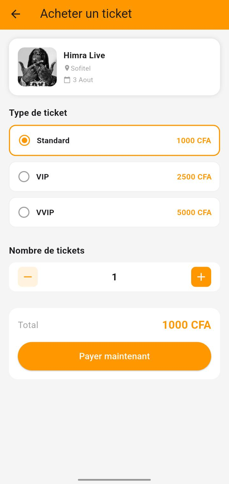

# event

Ce projet a été réalisé dans le cadre de ma remise à niveau en développement frontend avec Flutter.

Il s’agit d’une application d’événements qui regroupe les différents événements en Côte d’Ivoire 🇨🇮, afin de permettre aux utilisateurs de découvrir facilement les activités autour d’eux.

Design inspiré de Pinterest pour une expérience moderne et intuitive.

Clean architecture

  
  
 

## Getting Started

This project is a starting point for a Flutter application.

A few resources to get you started if this is your first Flutter project:

- [Learn Flutter](https://docs.flutter.dev/get-started/learn-flutter)
- [Write your first Flutter app](https://docs.flutter.dev/get-started/codelab)
- [Flutter learning resources](https://docs.flutter.dev/reference/learning-resources)

For help getting started with Flutter development, view the
[online documentation](https://docs.flutter.dev/), which offers tutorials,
samples, guidance on mobile development, and a full API reference.
